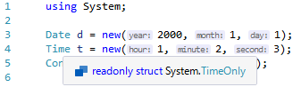

# RemoveOnly

This package removes "Only" from [`DateOnly`](https://docs.microsoft.com/ja-jp/dotnet/api/system.dateonly)/[`TimeOnly`](https://docs.microsoft.com/ja-jp/dotnet/api/system.timeonly), which are new structs added in .NET 6.



See: [Date, Time, and Time Zone Enhancements in .NET 6 - Why are they named “Only”?](https://devblogs.microsoft.com/dotnet/date-time-and-time-zone-enhancements-in-net-6/#why-are-they-named-only) 

## How to use

https://www.nuget.org/packages/RemoveOnly/

[](https://www.nuget.org/packages/RemoveOnly)

## How this works

* This NuGet package contains a Roslyn source generator
* It generates a following C# code in [PostInitialization](https://docs.microsoft.com/en-us/dotnet/api/microsoft.codeanalysis.generatorinitializationcontext.registerforpostinitialization?view=roslyn-dotnet-3.10.0)

```cs
// <auto-generated />
#if NET6_0_OR_GREATER
global using Date = System.DateOnly;
global using Time = System.TimeOnly;
#endif
```

* [Global using directives](https://github.com/dotnet/csharplang/issues/3428) have project-wide effects
* All of projects dependent on this package transitively are affected, because NuGet dependency resolution is transitive and this package does not specify `PrivateAssets` property
